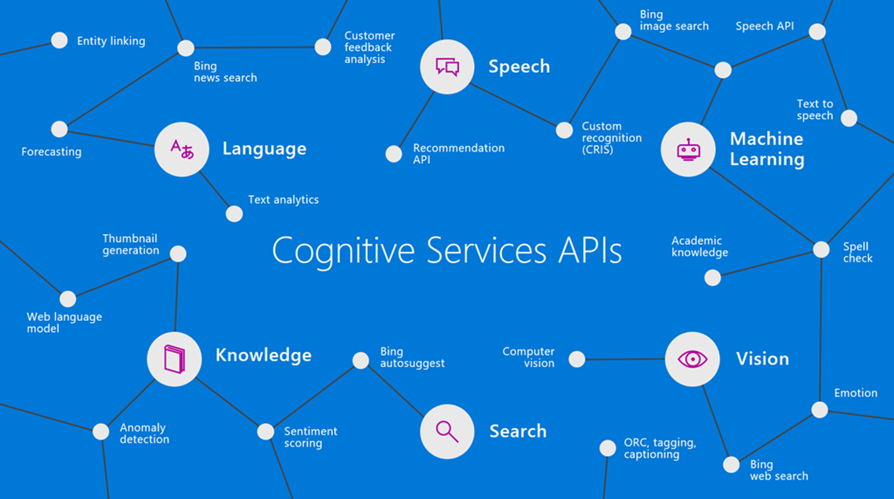

# Virtual AI Hack Day 2022

Event details: https://aihackday.com/

Presentations: https://github.com/jernejk/aihackday2022/tree/main/Melbourne/Presentations

## Getting Started with Cognitive Services

How to get started with Cognitive Services, many examples of Cognitives Services and how to use them.

### References:

- [Azure Cognitive Services](https://azure.microsoft.com/en-au/services/cognitive-services/)
- [AI demos by JK](https://github.com/jernejk?tab=repositories)
- [JK's blog - jkdev.me](https://jkdev.me/tag/ai/)
- [Cognitive Studio - Open Source tool to play around with Cognitive Services](https://cognitivestudio.dev/)
- [Power Automate](https://australia.flow.microsoft.com/en-us/)
- [AI Builder in Power Apps](https://docs.microsoft.com/en-us/powerapps/use-ai-builder)
- [AI Builder in Power Automate](https://docs.microsoft.com/en-us/ai-builder/use-in-flow-overview)
- [AI School](https://www.microsoft.com/en-us/ai/ai-school)

## Enable easy ML model deployment using tools of your own preference with ONNX

Over the years, data scientists and engineers have worked on great tools to build and generate useful machine learning models across different industries. Open Neural Network Exchange is an open ecosystem which empowers data scientists and engineers to collaborate. With ONNX, we are able to export our machine learning models to a standard format so it can be deployed and used by other applications. In the talk, I will show you what is ONNX and how we can leverage it to deploy our ML models to different apps including frontend web app as well as backend server app.

### References

- [Get started with Bot Framework Composer](https://github.com/Microsoft/BotFramework-Composer)

## MS Learn

Microsoft Learn is a free online learning platform that helps you learn about the latest technologies and tools.

### References

- [Microsoft Learn](https://www.microsoft.com/en-us/learning/)

## Presenters

- Patrick Zhao - [Twitter](https://twitter.com/paladinapay)
- Jernej Kavka (JK) - [Twitter](https://twitter.com/jernej_kavka)
- William Liebenberg - [Twitter](https://twitter.com/William_DotNet)

## Additional community contributions

- [Global AI Podcast](https://globalai.live/ai-the-podcast/)
- [APAC AI Community](https://www.meetup.com/apac-ai-community/)
- [Cognitive Studio](https://cognitivestudio.dev/) (open source exploration tool for Cognitive Services)
