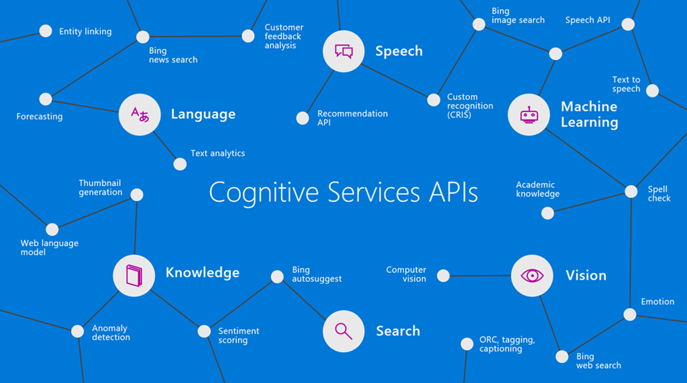

# AI Hack Day 2022 - Sydney

Event details: https://aihackday.com/

Presentations: https://github.com/jernejk/aihackday2022/tree/main/Sydney/Presentations

## Getting Started with Cognitive Services

How to get started with Cognitive Services, many examples of Cognitives Services and how to use them.

### References:

- [Azure Cognitive Services](https://azure.microsoft.com/en-au/services/cognitive-services/)
- [AI demos by JK](https://github.com/jernejk?tab=repositories)
- [JK's blog - jkdev.me](https://jkdev.me/tag/ai/)
- [Cognitive Studio - Open Source tool to play around with Cognitive Services](https://cognitivestudio.dev/)
- [Power Automate](https://australia.flow.microsoft.com/en-us/)
- [AI Builder in Power Apps](https://docs.microsoft.com/en-us/powerapps/use-ai-builder)
- [AI Builder in Power Automate](https://docs.microsoft.com/en-us/ai-builder/use-in-flow-overview)
- [AI School](https://www.microsoft.com/en-us/ai/ai-school)

## AI/ML in Power Bi

An overview on AI/ML within Power BI and on how to leverage its capabilities.

### References

- [Power Bi](https://powerbi.microsoft.com/)

## Boost your Customer Service with Opinion Mining 

Good service acts as a catalyst for your customers and helps you get new customers, absolutely (or almost) free of charge. These customers express their opinions about range of things, every day. As this unstructured, raw data grows, it gets more difficult to analyse hence, to tackle these issues, a natural language processing technique (NLP) comes into play which is called Opinion Mining.

### References

## MS Learn

Microsoft Learn is a free online learning platform that helps you learn about the latest technologies and tools.

### References

- [Microsoft Learn](https://www.microsoft.com/en-us/learning/)

## Presenters

- Arafat Tehsin - [Twitter](https://twitter.com/arafattehsin)
- Somy Ayazi - [Twitter](https://twitter.com/SomyAyazi)
- Jernej Kavka (JK) - [Twitter](https://twitter.com/jernej_kavka)

## Additional community contributions

- [Global AI Podcast](https://globalai.live/ai-the-podcast/)
- [APAC AI Community](https://www.meetup.com/apac-ai-community/)
- [Cognitive Studio](https://cognitivestudio.dev/) (open source exploration tool for Cognitive Services)
